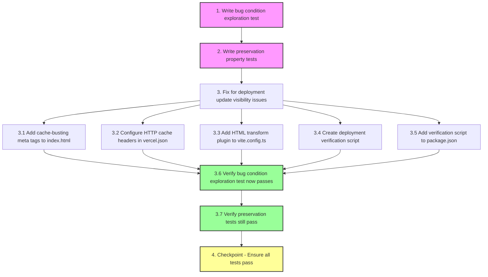

# Implementation Plan

## Overview

This implementation plan addresses the deployment update visibility issue where code changes pushed to the repository do not reflect on the live Vercel-deployed website. The plan follows the bugfix workflow methodology with three phases: (1) write exploration tests to confirm the bug exists on unfixed code, (2) write preservation tests to capture existing behavior that must remain unchanged, and (3) implement the fix with cache-busting mechanisms, proper HTTP headers, and deployment verification.

The fix focuses on three key areas: implementing deployment version meta tags for cache busting, configuring appropriate Cache-Control headers for HTML pages and static assets, and establishing automated deployment verification to ensure changes are live within 60 seconds of Vercel's "Ready" status.

## Tasks

- [-] 1. Write bug condition exploration test
  - **Property 1: Bug Condition** - Deployment Reflects Within 60 Seconds
  - **CRITICAL**: This test MUST FAIL on unfixed code - failure confirms the bug exists
  - **DO NOT attempt to fix the test or the code when it fails**
  - **NOTE**: This test encodes the expected behavior - it will validate the fix when it passes after implementation
  - **GOAL**: Surface counterexamples that demonstrate the bug exists
  - **Scoped PBT Approach**: Deploy a visible change (unique timestamp text on homepage) and verify it appears on production within 60 seconds without hard refresh
  - Test implementation details from Bug Condition in design:
    - Deploy a test change to main branch
    - Wait for Vercel deployment to reach "Ready" status
    - Wait 60 seconds after "Ready" status
    - Fetch production URL without cache-busting parameters
    - Extract deployment-version meta tag from response
    - Assert deployment version matches deployed commit SHA
    - Assert response content matches deployed commit content
  - The test assertions should match the Expected Behavior Properties from design:
    - Production website serves updated content within 60 seconds of "Ready" status
    - No hard refresh or manual cache clearing required
    - Content matches deployed commit SHA
  - Run test on UNFIXED code
  - **EXPECTED OUTCOME**: Test FAILS (this is correct - it proves the bug exists)
  - Document counterexamples found to understand root cause:
    - Production continues serving old content beyond 60 seconds
    - Missing deployment-version meta tag in HTML
    - Aggressive Cache-Control headers (e.g., max-age=3600)
    - CDN not invalidating cache on new deployment
  - Mark task complete when test is written, run, and failure is documented
  - _Requirements: 2.1, 2.2, 2.3, 2.5, 2.6_

- [~] 2. Write preservation property tests (BEFORE implementing fix)
  - **Property 2: Preservation** - Existing Functionality Unchanged
  - **IMPORTANT**: Follow observation-first methodology
  - Observe behavior on UNFIXED code for non-buggy inputs (normal operations outside deployment windows)
  - Write property-based tests capturing observed behavior patterns from Preservation Requirements:
    - Build process exits with code 0 and produces dist/ directory
    - Static assets return HTTP 200 with correct Content-Type headers
    - API endpoints execute latest code and return expected response structures
    - Environment variables accessible in both server-side and client-side code
    - First-time users receive current deployed version
    - Build failures prevent deployment and exit with non-zero code
  - Property-based testing generates many test cases for stronger guarantees:
    - Generate random page routes and verify correct responses
    - Generate random static asset requests and verify caching behavior
    - Generate random API endpoint calls and verify response structures
    - Test environment variable access patterns in different contexts
  - Run tests on UNFIXED code
  - **EXPECTED OUTCOME**: Tests PASS (this confirms baseline behavior to preserve)
  - Mark task complete when tests are written, run, and passing on unfixed code
  - _Requirements: 3.1, 3.2, 3.3, 3.4, 3.5, 3.6, 3.7, 3.8, 3.9, 3.10_

- [ ] 3. Fix for deployment update visibility issues

  - [~] 3.1 Add cache-busting meta tags to index.html
    - Add deployment version meta tag: `<meta name="deployment-version" content="{{COMMIT_SHA}}">`
    - Add cache control meta tag: `<meta http-equiv="Cache-Control" content="no-cache, no-store, must-revalidate">`
    - Add pragma meta tag: `<meta http-equiv="Pragma" content="no-cache">`
    - Add expires meta tag: `<meta http-equiv="Expires" content="0">`
    - Place all meta tags in the `<head>` section
    - _Bug_Condition: isBugCondition(input) where input.deploymentStatus == "Ready" AND input.timeSinceReady > 60 seconds AND productionWebsiteContent != input.deployedCommitContent_
    - _Expected_Behavior: Production website serves content matching deployed commit SHA within 60 seconds of "Ready" status without requiring hard refresh_
    - _Preservation: Build process, API functionality, environment variables, and static asset serving remain unchanged_
    - _Requirements: 2.1, 2.2, 2.3, 2.5, 2.6_

  - [~] 3.2 Configure HTTP cache headers in vercel.json
    - Create or update vercel.json in project root
    - Add headers configuration section with three rules:
      - HTML files: `Cache-Control: public, max-age=0, must-revalidate`
      - Root path: `Cache-Control: public, max-age=0, must-revalidate`
      - Assets directory: `Cache-Control: public, max-age=31536000, immutable`
    - Verify configuration syntax is valid JSON
    - _Bug_Condition: isBugCondition(input) where aggressive CDN caching prevents new content from being served_
    - _Expected_Behavior: HTML pages are not cached aggressively, static assets remain cached with content hashes_
    - _Preservation: Static asset caching behavior with content hashes remains unchanged_
    - _Requirements: 2.1, 2.2, 3.2, 3.5, 3.6_

  - [~] 3.3 Add HTML transform plugin to vite.config.ts
    - Open vite.config.ts
    - Add a custom Vite plugin named 'html-transform' to the plugins array
    - Implement transformIndexHtml hook that replaces {{COMMIT_SHA}} placeholder with process.env.VERCEL_GIT_COMMIT_SHA
    - Use fallback value 'local-dev' when VERCEL_GIT_COMMIT_SHA is not available
    - Verify plugin is added to the plugins array in the config
    - _Bug_Condition: isBugCondition(input) where missing deployment version indicator prevents verification_
    - _Expected_Behavior: Deployment version meta tag contains actual commit SHA at build time_
    - _Preservation: Vite build process continues to produce dist/ output with content-hashed filenames_
    - _Requirements: 2.1, 2.3, 2.5, 3.3_

  - [~] 3.4 Create deployment verification script
    - Create scripts/verify-deployment.js file
    - Implement verification logic:
      - Fetch production URL using fetch or https module
      - Parse HTML response and extract deployment-version meta tag
      - Compare extracted version with VERCEL_GIT_COMMIT_SHA environment variable
      - Exit with code 0 if versions match, code 1 if mismatch
    - Implement retry logic with exponential backoff:
      - Retry up to 5 times with 15-second intervals
      - Log each attempt with timestamp and result
    - Add error handling for network failures and parsing errors
    - _Bug_Condition: isBugCondition(input) where lack of verification allows undetected deployment failures_
    - _Expected_Behavior: Automated verification confirms production serves new content within 60 seconds_
    - _Preservation: Build process success/failure behavior remains unchanged_
    - _Requirements: 2.1, 2.3, 2.5, 3.3, 3.4_

  - [~] 3.5 Add verification script to package.json
    - Open package.json
    - Add new script: `"verify-deployment": "node scripts/verify-deployment.js"`
    - Ensure script can be run with npm run verify-deployment
    - Document script usage in comments or README
    - _Bug_Condition: isBugCondition(input) where manual verification is error-prone and time-consuming_
    - _Expected_Behavior: Developers can run automated verification to confirm deployment success_
    - _Preservation: Existing npm scripts continue to function as before_
    - _Requirements: 2.5, 3.3_

  - [~] 3.6 Verify bug condition exploration test now passes
    - **Property 1: Expected Behavior** - Deployment Reflects Within 60 Seconds
    - **IMPORTANT**: Re-run the SAME test from task 1 - do NOT write a new test
    - The test from task 1 encodes the expected behavior
    - When this test passes, it confirms the expected behavior is satisfied
    - Run bug condition exploration test from step 1:
      - Deploy a test change to main branch
      - Wait for Vercel deployment to reach "Ready" status
      - Wait 60 seconds after "Ready" status
      - Fetch production URL without cache-busting parameters
      - Extract deployment-version meta tag from response
      - Assert deployment version matches deployed commit SHA
      - Assert response content matches deployed commit content
    - **EXPECTED OUTCOME**: Test PASSES (confirms bug is fixed)
    - Verify all assertions pass:
      - Deployment version meta tag exists and matches commit SHA
      - Response content matches deployed commit content
      - No hard refresh required
      - Changes visible within 60 seconds of "Ready" status
    - _Requirements: 2.1, 2.2, 2.3, 2.5, 2.6_

  - [~] 3.7 Verify preservation tests still pass
    - **Property 2: Preservation** - Existing Functionality Unchanged
    - **IMPORTANT**: Re-run the SAME tests from task 2 - do NOT write new tests
    - Run preservation property tests from step 2:
      - Build process tests (exit code 0, dist/ directory created)
      - Static asset tests (HTTP 200, correct Content-Type, content hashes)
      - API endpoint tests (latest code execution, expected response structures)
      - Environment variable tests (server-side and client-side access)
      - First-time user tests (receive current deployed version)
      - Build failure tests (non-zero exit code, no deployment)
    - **EXPECTED OUTCOME**: Tests PASS (confirms no regressions)
    - Confirm all tests still pass after fix:
      - Build process behavior unchanged
      - Static asset serving unchanged
      - API endpoint execution unchanged
      - Environment variable access unchanged
      - User experience for non-deployment scenarios unchanged
    - _Requirements: 3.1, 3.2, 3.3, 3.4, 3.5, 3.6, 3.7, 3.8, 3.9, 3.10_

- [~] 4. Checkpoint - Ensure all tests pass
  - Run full test suite including:
    - Bug condition exploration test (should now pass)
    - Preservation property tests (should still pass)
    - Unit tests for HTML transform plugin
    - Unit tests for verification script
    - Integration tests for full deployment flow
  - Verify deployment verification script runs successfully
  - Test deployment flow end-to-end:
    - Push a visible change to main branch
    - Monitor Vercel deployment status
    - Run verification script after "Ready" status
    - Confirm production serves new content within 60 seconds
    - Verify no hard refresh required for users
  - Document any issues or edge cases discovered
  - Ensure all tests pass before considering the fix complete
  - Ask the user if questions arise or if additional verification is needed

## Notes

### Testing Methodology

This implementation follows the bug condition methodology:
- **Bug Condition (C)**: Deployment reaches "Ready" status but production website continues serving old content beyond 60 seconds
- **Expected Behavior (P)**: Production website serves updated content within 60 seconds without hard refresh
- **Preservation (¬C)**: All existing functionality (build process, API endpoints, static assets, environment variables) remains unchanged

### Key Implementation Details

1. **Cache-Busting Strategy**: The fix uses deployment version meta tags injected at build time to force browsers and CDN to recognize new deployments. The meta tag contains the commit SHA from Vercel's environment variable.

2. **HTTP Header Configuration**: HTML pages use `Cache-Control: public, max-age=0, must-revalidate` to prevent aggressive caching while static assets with content hashes use `Cache-Control: public, max-age=31536000, immutable` for optimal performance.

3. **Deployment Verification**: An automated verification script checks that the production URL serves the expected commit SHA within 60 seconds, with retry logic to account for CDN propagation delays.

4. **Property-Based Testing**: Preservation tests use property-based testing to generate many test cases automatically, providing stronger guarantees that existing behavior is unchanged across the entire input domain.

### Potential Risks

- **CDN Propagation Delays**: Vercel's global CDN may take longer than 60 seconds to propagate changes to all edge nodes in some geographic regions. The verification script includes retry logic to handle this.
- **Browser Cache Persistence**: Some browsers may ignore meta tags and require explicit HTTP headers. The fix includes both meta tags and HTTP headers for defense in depth.
- **Build Time Injection**: The HTML transform plugin depends on `VERCEL_GIT_COMMIT_SHA` being available at build time. Local development uses a fallback value of 'local-dev'.

### Success Criteria

The fix is considered successful when:
1. Bug condition exploration test passes (production serves new content within 60 seconds)
2. All preservation tests pass (existing functionality unchanged)
3. Deployment verification script confirms version match within 60 seconds
4. No hard refresh required for users to see new deployments
5. Multiple users in different locations see new content simultaneously

## Task Dependency Graph

```json
{
  "waves": [
    {
      "name": "Wave 1: Exploration Testing",
      "tasks": ["1"]
    },
    {
      "name": "Wave 2: Preservation Testing",
      "tasks": ["2"]
    },
    {
      "name": "Wave 3: Implementation",
      "tasks": ["3.1", "3.2", "3.3", "3.4", "3.5"]
    },
    {
      "name": "Wave 4: Verification",
      "tasks": ["3.6", "3.7"]
    },
    {
      "name": "Wave 5: Checkpoint",
      "tasks": ["4"]
    }
  ]
}
```



### Dependency Explanation

- **Task 1 → Task 2**: Exploration test must be written first to understand the bug before writing preservation tests
- **Task 2 → Task 3**: Preservation tests must pass on unfixed code before implementing the fix
- **Task 3.1-3.5 → Task 3.6**: All implementation sub-tasks must be complete before verifying the bug is fixed
- **Task 3.6 → Task 3.7**: Bug fix verification must pass before checking preservation
- **Task 3.7 → Task 4**: All tests must pass before final checkpoint

**Critical Path**: Tasks 1 → 2 → 3.1-3.5 (parallel) → 3.6 → 3.7 → 4

**Parallelizable Tasks**: Tasks 3.1, 3.2, 3.3, 3.4, and 3.5 can be implemented in parallel as they modify different files and have no interdependencies.
